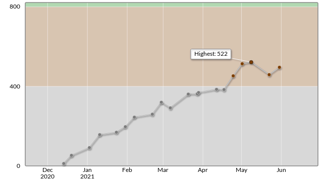

# atu4403

atu4403の個人情報満載リポジトリ

## works - 制作物一覧

### PyPI
- [env-paths](https://pypi.org/project/env-paths/): Returns the directory where the cache is located. This is different for each os.
- [timeit2](https://pypi.org/project/timeit2/): extended version of timeit package
- [remind-task](https://pypi.org/project/remind-task/): 

### qiita
- [[python] 仮想通貨APIからローソク足チャートを作る簡単な方法](https://qiita.com/atu4403/items/42d64c9fa9302cfa6c8a): 2021-05-01
- [使っていないPCをサーバー化してみた](https://qiita.com/atu4403/items/6ea6721f00c477dcca5b): 2020-12-28
- [APIをお手軽にコマンド化する方法](https://qiita.com/atu4403/items/35a9bfac0e0bccb2b403): 2020-12-15
- [奇数判定とbit演算子](https://qiita.com/atu4403/items/36b2a7de126b9d4dbfcb): 2020-12-08
- [どのキーをショートカットに割り当てたらいいのかわからない問題(for Mac)](https://qiita.com/atu4403/items/9a2da7ec97c24b452c78): 2020-12-07
- [vagrant upに失敗した時の対応策](https://qiita.com/atu4403/items/a408645412a0cbd6a465): 2020-12-03
- [[個人開発あるある] 失われたリポジトリを発掘する旅に出る](https://qiita.com/atu4403/items/600163b791d0bea58910): 2020-11-28
- [pythonのopenでチルダ(~)で始まるパスを指定したら行方不明になった話](https://qiita.com/atu4403/items/7b7f6897fdf6f8b7d883): 2020-11-14

### GitHub Repository
- [adash](https://github.com/atu4403/adash): pythonユーティリティ
- [atu4403](https://github.com/atu4403/atu4403): atu4403のプロフィール
- [cookiecutter-simple-poetry](https://github.com/atu4403/cookiecutter-simple-poetry): cookiecutter template
- [env-paths](https://github.com/atu4403/env-paths): sindresorhus/env-pathsのpython version
- [fish_conf](https://github.com/atu4403/fish_conf): fishの設定ファイル
- [flask_app_template](https://github.com/atu4403/flask_app_template): poetry + flask + semantic-uiのボイラープレート
- [images](https://github.com/atu4403/images): netlifyを使った個人用画像サーバー
- [moncoll](https://github.com/atu4403/moncoll): pythonのmongodbラッパー(pypi未登録)
- [moncoll2](https://github.com/atu4403/moncoll2): pymongoの薄いラッパー
- [poetry-setup-multi-platform](https://github.com/atu4403/poetry-setup-multi-platform): GitHub Actionsでpoetryを使えるようにする
- [profile_build_tools](https://github.com/atu4403/profile_build_tools): GitHubのProfileページのREADMEを自動更新する
- [pytest_spec](https://github.com/atu4403/pytest_spec): pytestの使い方メモ
- [python-specs](https://github.com/atu4403/python-specs): pythonの仕様等を確認する為のリポジトリ
- [remind_task](https://github.com/atu4403/remind_task): macosで通知を繰り返すCLIアプリケーション
- [til](https://github.com/atu4403/til): til - Today I learned.
- [timeit2](https://github.com/atu4403/timeit2): pythonの処理時間を計測

### AtCoder

  
  

